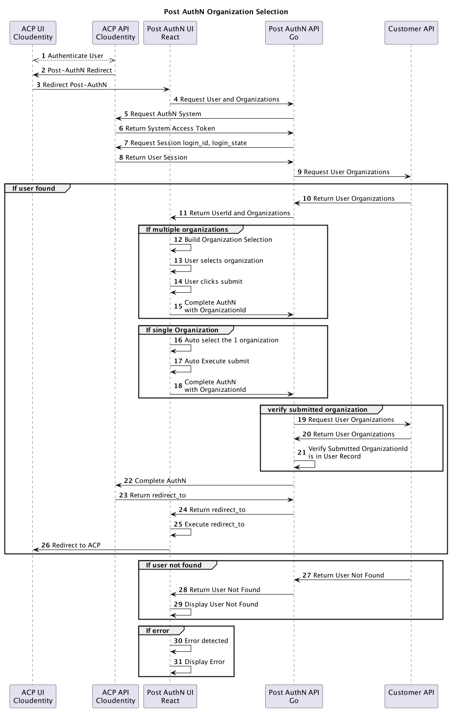

# ce-samples-post-authn project

This project contains to modules.
- ce-samples-post-authn-ui-react (Post AuthN UI React)
- ce-samples-post-authn-api-go (Post AuuthN API Go)

## System Sequence Diagram



## ce-samples-post-authn-ui-react

The module contains the UI code written in React.

### Functionality

- User interface
- Calls to the backend API to get the current ACP session and customer's organization
- Contains logic for the following use cases
  - User has more then 1 organization
    - User is required to select one organization
    - User clicks submit
  - User has only 1 organization
    - System automatically sets user ogranization
    - System completes the authentication process
  - User does not exist in customer organizations
    - Display error directing user to next steps
  - System error
    - Display error

### Run the code

```
./run.sh
```

## ce-samples-post-authn-api-go

This module contains the API code written in GoLang.

### Functionality

- Provide server side authentication with ACP
- Keep ACP and customer API credentials secret
- Package up ACP session and customer API response and return it to UI

### Run the code

```
./run.sh
```
