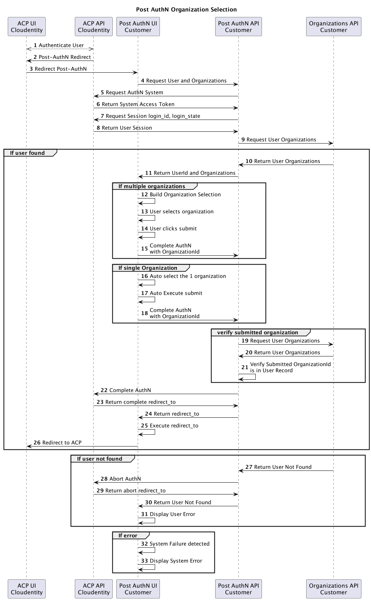

# ce-samples-post-authn project

This project supports the following use cases.

- User with multiple organizations, organization selection
- User with one organization, flow thru
- User with zero organizations, display User Error
- System failure, display System Error

## Front End Code

Post AuthN UI React 

- [ce-samples-post-authn-ui-react](ce-samples-post-authn-ui-react/README-npm.md)

## Back End Code

Post AuuthN API Go

- [ce-samples-post-authn-api-go](ce-sample-post-authn-api-go/README.md)

## Configure ACP process

[Configure ACP](README-acp.md)

## Test Use Cases

[Test Use Cases](README-test.md)

## Post-AuthN Organization Selection Sequence Diagram

